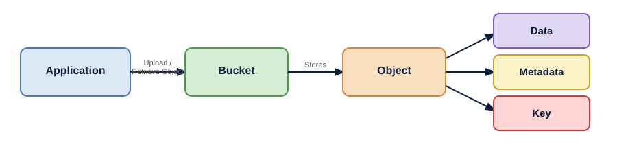
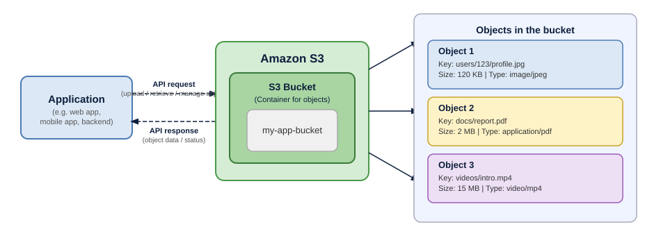
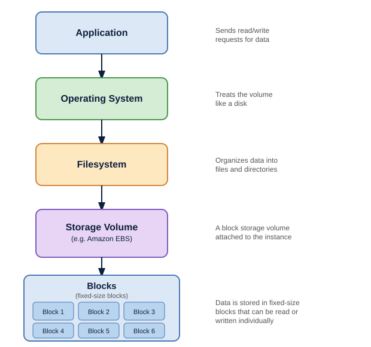
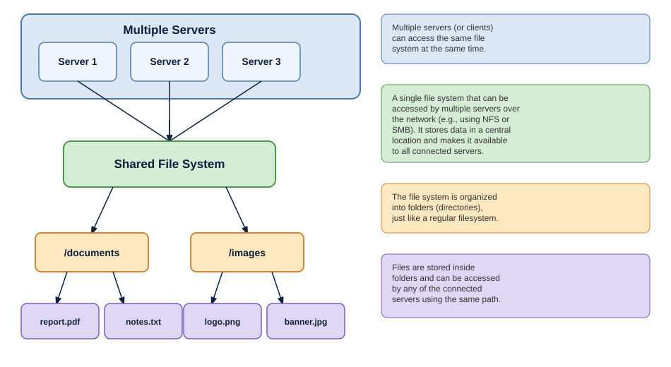

# Understanding the Types of Storage: Object, Block, and File

Whenever an application generates data, that data needs somewhere to live.

It could be a profile picture uploaded by a user, records being written to a database, logs generated by an application, or documents that need to be accessed by multiple systems. Although all of these are simply data, the way they need to be stored and accessed can be very different.

This is where the type of storage becomes important.

In cloud computing, three storage models are commonly used:

- Object Storage
- Block Storage
- File Storage

Each organizes data differently and is designed around a different way of accessing it.

---

## Object Storage

Object storage stores data as individual units called objects. Each object contains the actual data along with information that describes it, rather than being organized as a traditional file on a disk.

An object generally consists of three parts:

| Part | Description |
|------|-------------|
| **Data** | The actual content, such as an image, video, document, or backup |
| **Metadata** | Information about the object, such as its size, content type, or other attributes |
| **Key** | A unique identifier used to locate the object |

These objects are stored inside a container commonly called a **bucket**. Applications interact with the storage through APIs, using the object's key to store or retrieve it.



### How does it work?

For example, an application might upload a profile picture to a bucket. The image becomes an object and is assigned a key such as:

```
users/123/profile.jpg
```

When the application needs the image, it uses that key to retrieve the object from the storage system.

The storage system treats the image as a complete object. The application isn't working with individual disk blocks or navigating a traditional directory structure to access it.

### How is Object Storage accessed?

Object storage is typically accessed through an **API** rather than being mounted as a disk. An application can send requests to store, retrieve, or manage objects.

**Amazon S3** is a common example. In S3, objects are stored inside buckets, and the application uses the object's key to access them.



The storage service manages the underlying infrastructure and can scale to handle very large amounts of data. Objects are also generally treated as **complete units**, so changing an object usually means replacing or rewriting it rather than modifying a small part of it.

---

## Block Storage

Block storage divides the storage space into **fixed-size blocks** and presents them to a system as a storage volume.

The operating system can then treat that volume much like a physical disk. It can format it with a filesystem, create files and directories, and read or write data to specific locations on the volume.

This also means that applications can read and modify specific parts of the data without having to rewrite the entire file or object.

### How does it work?

A useful way to picture it is to think of a disk divided into many small sections. Each block has an address, and the system can access the blocks it needs without having to work with the entire piece of data.



In AWS, **Amazon EBS (Elastic Block Store)** is an example of block storage. An EBS volume can be attached to an EC2 instance and used as a disk by the operating system.

Because block storage allows data to be read and written at the block level, applications can modify data without replacing the entire object. The storage volume is also mutable, meaning its contents can be changed as the application runs.

---

## File Storage

In file storage, files are organized into folders and directories.

Instead of accessing individual objects or working directly with blocks, applications interact with data through a filesystem. Files can be created, modified, moved, and accessed using familiar paths.

For example, a shared file system might look like this:

```
/project
 ├── /documents
 │    ├── report.pdf
 │    └── notes.txt
 │
 └── /images
      ├── logo.png
      └── banner.jpg
```

### How does it work?

File storage is commonly accessed over a network using file-sharing protocols such as:

- **NFS (Network File System)** — for Linux-based systems
- **SMB (Server Message Block)** — for Windows environments

One of the important characteristics of file storage is that the same filesystem can be made available to multiple clients or servers. Each client can work with the files through the same directory structure, rather than maintaining separate copies of the data.



In AWS, **Amazon EFS (Elastic File System)** is an example of managed file storage. An EFS filesystem can be accessed by multiple compute resources, while AWS manages the underlying storage infrastructure.

---

## Object Storage vs Block Storage vs File Storage

| | Object Storage | Block Storage | File Storage |
|---|---|---|---|
| **How Data is Stored** | Objects | Fixed-size blocks | Files and folders |
| **How it is Accessed** | Through APIs | As a disk/volume | Through a filesystem |
| **Data Organization** | Buckets and object keys | Blocks within a volume | Files and directories |
| **Shared Access** | Accessible through APIs | Typically attached to a system | Designed for shared access |
| **AWS Example** | Amazon S3 | Amazon EBS | Amazon EFS |

---

## Where Does Each Storage Type Fit?

The choice usually comes down to how an application needs to access its data.

- **Object storage** is a good fit for large amounts of unstructured data such as images, videos, backups, logs, and documents. Applications typically access these objects through APIs, making services like Amazon S3 a common choice.

- **Block storage** is useful when storage needs to behave like a disk. A virtual machine can attach a block storage volume and use it for workloads such as databases or application data. Amazon EBS is an example.

- **File storage** works well when applications need a shared filesystem with familiar files, folders, and paths. It can be accessed by multiple servers at the same time, with Amazon EFS being a common example.

---

## Conclusion

Object, block, and file storage all solve the same basic problem of storing data, but they approach it differently.

- **Object storage** focuses on storing complete objects
- **Block storage** provides disk-like storage for systems
- **File storage** organizes data through shared files and directories

Understanding these differences makes it easier to choose the right storage model based on how an application needs to store and access its data.
